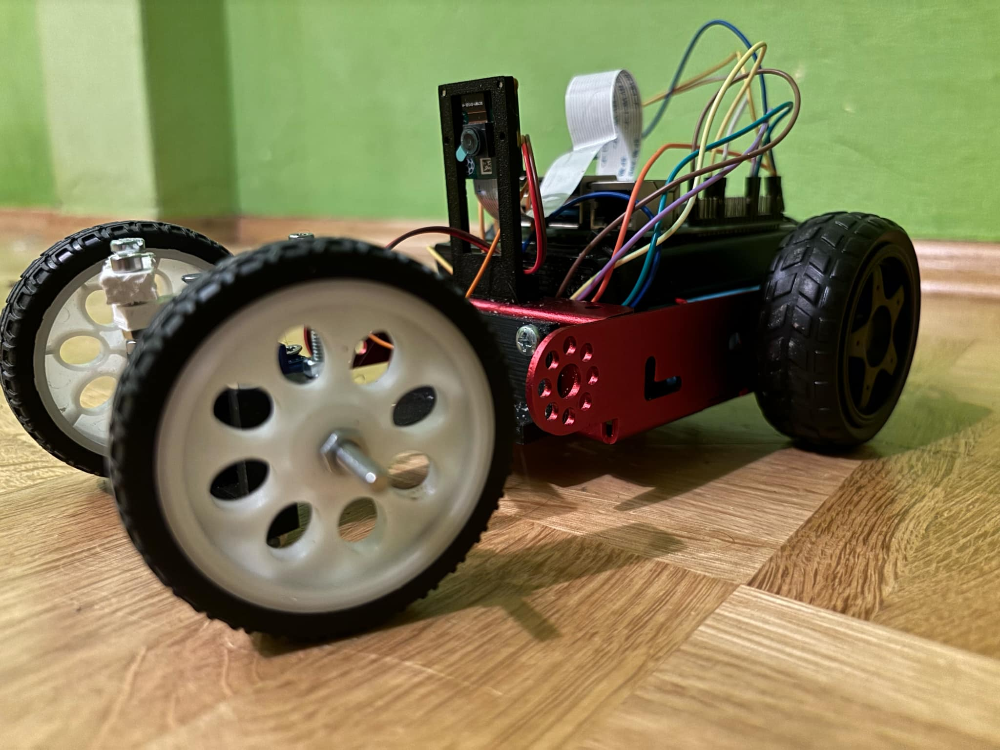
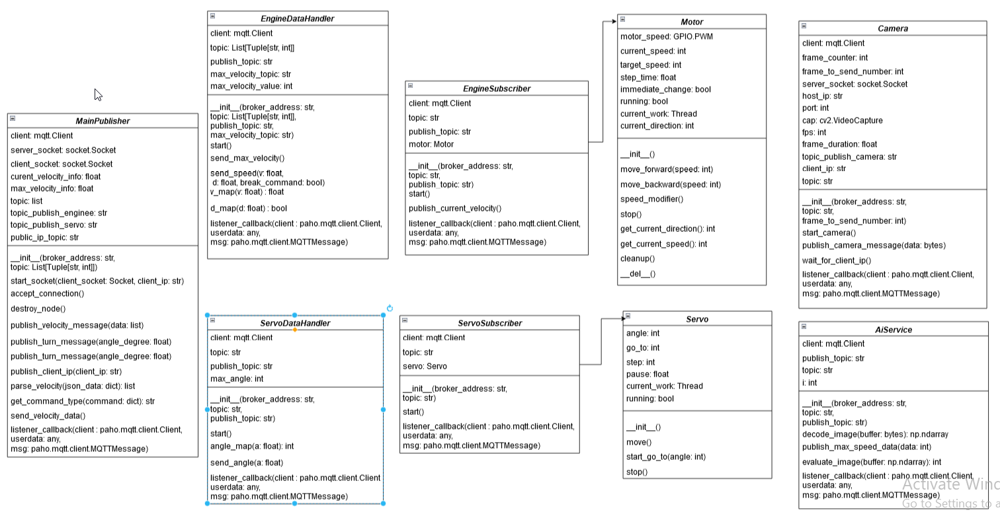
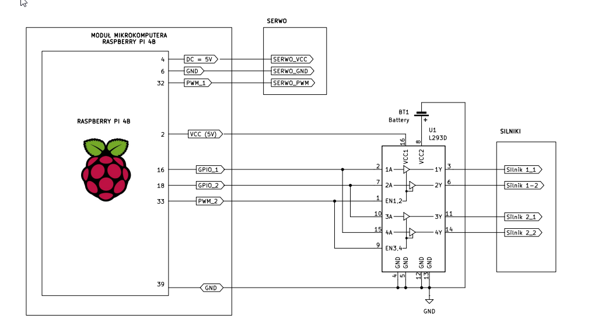
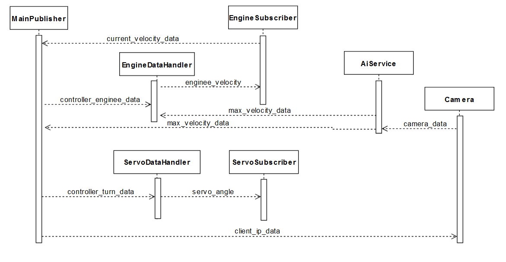

# RC Car with Raspberry Pi

A compact RC car prototype based on Raspberry Pi 4. The vehicle features remote control via a mobile app, real-time camera feed, basic AI support, and custom 3D-printed components.

Developed as part of an engineering capstone project at the University of Commission of National Education in Cracow.

 <!-- Replace with actual image -->

## Features

- Remote control via a custom Android app
- Live video streaming from onboard camera
- Basic traffic sign recognition (speed limits)
- MQTT-based communication between components
- 3D-printed mechanical parts (steering, mounts, etc.)

## Tech Stack

- **Hardware:** Raspberry Pi 4B, L293D, SG90 servo, DC motors, Pi Camera
- **Software:** Python, OpenCV, MQTT (Mosquitto), RPi.GPIO, pigpiod
- **AI:** YOLOv5 for speed sign detection
- **Mobile App:** [CarApp](https://github.com/xWalian/CarApp) (React Native)

## System Overview

### Class Structure (Backend Architecture)

### Electronics Wiring Diagram

### Sequence of Communication (MQTT Flow)

## Author

**Mateusz Stępień** – backend, electronics, 3D printing  
(co-developed with Krzysztof Tyszkiewicz & Łukasz Świgut)
